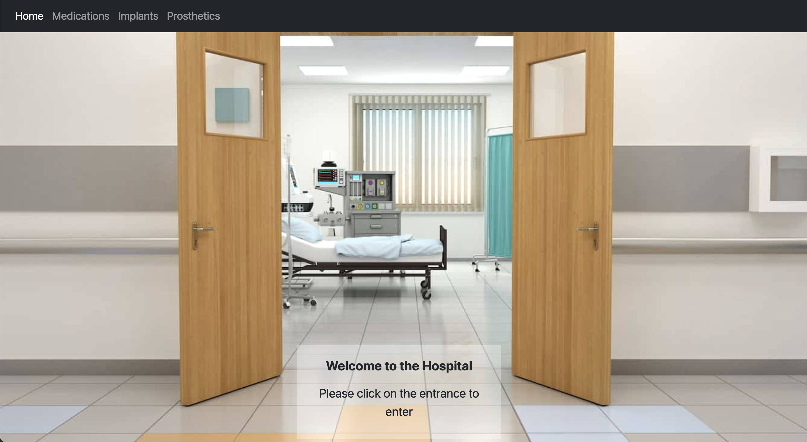

In my Programming Application Systems Class, ITM 352, I developed a Hospital E-commerence web application that I did by myself in Fall 2023 as my final project. The project helped me learn how to implement a responsive web site, create a shopping cart feature so users can shop, design multiple product pages for users to navigate through, and add a login page for users to save their products and see past purchases. 

The website was implemented using [Microsoft Visual Studio Code](http://meteor.com), sa ource-code editor developed by Microsoft for Windows, Linux and macOS. Within a few weeks, we created a website that implements several types of purchasing options, such as, medications, implants, and prosthetics.
